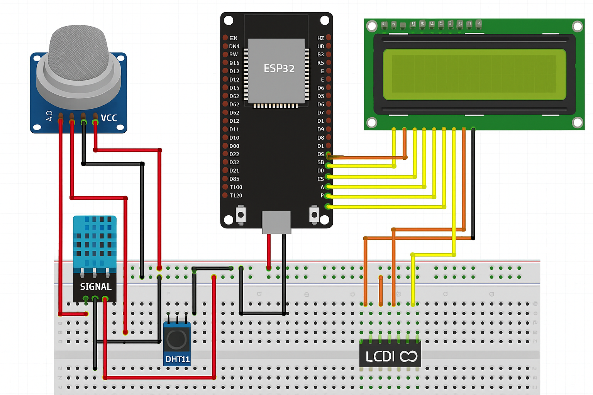

# 🌬️ Air Quality Monitoring System

A DIY air quality monitor using ESP32, MQ135, and DHT11 sensors, with live data logging and a web-based dashboard built in Python.

---

## 📦 Features

- Monitors **temperature**, **humidity**, and **air quality** (gas concentration)
- Logs data to CSV via serial port
- Displays latest readings in a Flask dashboard
- Real-time updates and expandable UI
- Fully open source & beginner-friendly

---

## 📸 Circuit Diagram



---

## 🛠️ Hardware Requirements

| Component           | Quantity |
|--------------------|----------|
| ESP32 (or ESP8266) | 1        |
| MQ135 Gas Sensor   | 1        |
| DHT11 Sensor       | 1        |
| Breadboard & Wires | -        |
| Optional: OLED/LCD | 1        |

---

## ⚙️ Setup Instructions

### 🔌 Step 1: Connect Hardware
- Connect **DHT11** to any digital GPIO pin (e.g., D4)
- Connect **MQ135** analog output to an ADC pin (e.g., A0)
- Power both sensors with 5V and GND

### 🧠 Step 2: Flash ESP32
- Open the file: `arduino/esp32_air_monitor.ino`
- Upload it to the ESP32 using the **Arduino IDE**
- Ensure correct board and COM port are selected

### 📋 Step 3: Log Data to CSV
Open a terminal and run the logger:
```bash
cd data_logger
python logger.py
```
This will:
- Read serial output from ESP32
- Save it with timestamps to `data_log.csv`

### 🌐 Step 4: Launch Flask Dashboard
```bash
cd dashboard
pip install -r ../requirements.txt
python app.py
```
Then open your browser at: [http://localhost:5000]
---
